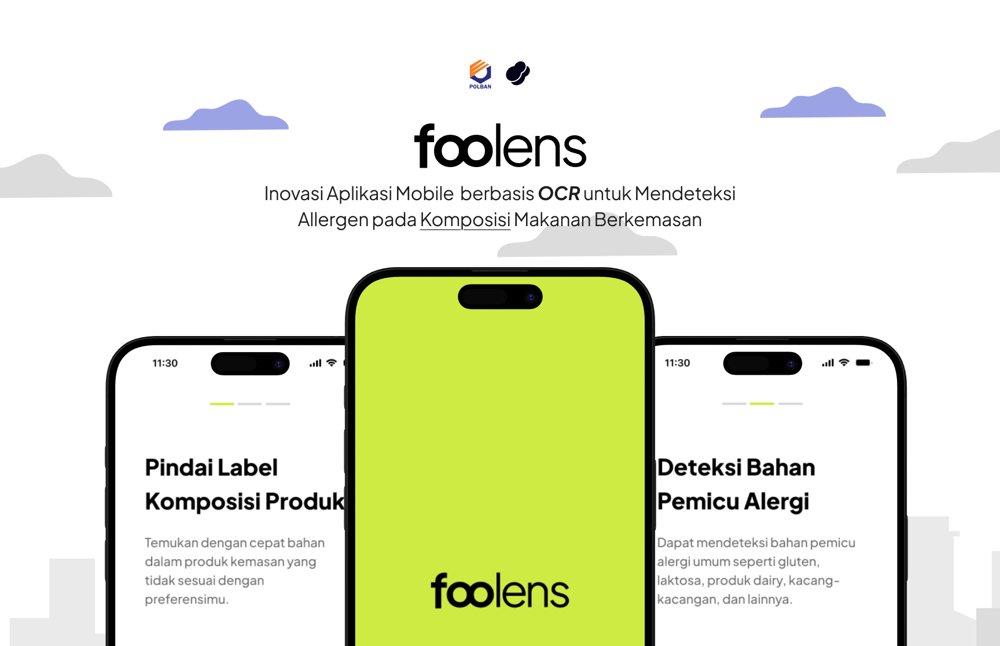

# Foolens - Inovasi Aplikasi Mobile  berbasis OCR untuk Membantu Pengguna dengan Alergi Bahan Makanan pada Komposisi Makanan Berkemasan

## Ringkasan

Foolens adalah aplikasi kesehatan digital inovatif yang dirancang untuk memberdayakan individu dengan alergi makanan. Dengan memanfaatkan teknologi Google ML Kit untuk Optical Character Recognition (OCR), kami menyediakan solusi cepat, akurat, dan ramah pengguna untuk mengenali potensi alergen dalam produk makanan kemasan.

## Fitur Aplikasi

### 1. Allergy Preferences
- **1.1 Add Allergy**: Menambahkan daftar alergen yang harus dihindari oleh pengguna ke dalam profil preferensi
- **1.2 Edit Allergy**: Mengedit daftar alergen yang telah ditetapkan oleh pengguna
- **1.3 Remove Allergy**: Menghapus alergen dari daftar preferensi pengguna

### 2. Product Scanning
- **2.1 Barcode Scanning**: Memindai barcode produk untuk mendapatkan informasi komposisi makanan
- **2.2 OCR Label Extraction**: Mengekstrak teks dari label komposisi menggunakan teknologi OCR untuk mendeteksi bahan-bahan produk

### 3. Allergen Detection
- **3.1 Ingredient Analysis**: Menganalisis komposisi bahan makanan berdasarkan daftar alergen pengguna
- **3.2 Allergy Warning Notification**: Memberikan peringatan jika produk mengandung bahan yang berisiko bagi pengguna

### 4. Scan History
- **4.1 View Scan History**: Menampilkan riwayat pemindaian produk yang pernah dilakukan oleh pengguna
- **4.2 Delete Scan History**: Menghapus entri tertentu dari riwayat pemindaian pengguna

### 5. User Account Management
- **5.1 Edit Profile**: Memungkinkan pengguna untuk mengubah informasi akun mereka
- **5.2 Change Password**: Mengizinkan pengguna untuk memperbarui atau mengganti kata sandi akun mereka

### 6. Authentication & Authorization
- **6.1 Register**: Pendaftaran akun baru untuk pengguna
- **6.2 Login**: Proses autentikasi pengguna untuk masuk ke dalam akun mereka
- **6.3 Logout**: Mengakhiri sesi pengguna dan mengeluarkan mereka dari akun
- **6.4 Password Recovery**: Memulihkan akses akun bagi pengguna yang lupa kata sandi

### 7. Product Recommendation
- **7.1 Alternative Product Suggestions**: Menyediakan rekomendasi alternatif produk yang bebas dari alergen

### 8. Summary Card
- **8.1 Total Scanned Products**: Menampilkan jumlah total produk yang telah dipindai
- **8.2 Safe & Non-safe Product Percentage**: Menunjukkan persentase produk yang aman dan tidak aman
- **8.3 Most Frequent Allergens**: Mengidentifikasi daftar alergen yang paling sering muncul

### 9. Data Export
- **9.1 Export Scan History to PDF**: Mengekspor riwayat pemindaian dalam format PDF atau Excel

## Teknologi Inti
* Bahasa: Kotlin
* Arsitektur: Clean Architecture, MVVM
* DI: Hilt
* OCR: ML Kit Vision
* Asinkron: Coroutines, Flow

## Struktur Direktori

```
app/
└── src/main/java/com/example/foolens/
    ├── di/                           # Dependency Injection
    │   ├── NetworkModule.kt          # Konfigurasi dependensi jaringan
    │   ├── AppModule.kt              # Konfigurasi dependensi aplikasi
    │   └── AuthInterceptor.kt        # Interceptor untuk header otentikasi
    │
    ├── domain/                       # Layer Domain
    │   ├── model/                    # Model domain bisnis
    │   │   └── User.kt               # Definisi data class pengguna
    │   │
    │   ├── repository/               # Antarmuka repository
    │   │   └── AuthRepository.kt     # Antarmuka operasi otentikasi
    │   │
    │   └── usecase/                  # Logic bisnis
    │       └── AuthUseCase.kt        # Use case untuk otentikasi
    │
    ├── data/                         # Layer Data
    │   ├── remote/                   # Sumber data jarak jauh
    │   │   ├── api/                    
    │   │   │   └── ApiService.kt     # Antarmuka panggilan API
    │   │   │
    │   │   └── dto/                  # Objek Transfer Data
    │   │       └── UserDto.kt        # DTO untuk data pengguna
    │   │
    │   ├── preferences/              # Preferensi lokal
    │   │   └── PreferencesManager.kt # Pembungkus SharedPreferences
    │   │
    │   ├── repository/               # Implementasi repository
    │   │   └── AuthRepositoryImpl.kt # Implementasi AuthRepository
    │   │
    │   └── util/                     # Utilitas layer data
    │       ├── NetworkResult.kt      # Kelas tertutup untuk hasil jaringan
    │       └── DataMapper.kt         # Pemetaan transformasi data
    │
    ├── ui/                           # Layer Antarmuka Pengguna
    │   ├── auth/                     # Fitur Otentikasi
    │   │   ├── login/                  
    │   │   │   ├── LoginScreen.kt    # Layar login
    │   │   │   ├── LoginViewModel.kt # ViewModel untuk login
    │   │   │   └── LoginState.kt     # State untuk layar login
    │   │   │
    │   │   └── register/               
    │   │       ├── RegisterScreen.kt   # Layar registrasi
    │   │       ├── RegisterViewModel.kt # ViewModel untuk registrasi
    │   │       └── RegisterState.kt    # State untuk layar registrasi
    │   │
    │   ├── home/                     # Fitur Beranda
    │   │   ├── HomeScreen.kt         # Layar beranda
    │   │   ├── HomeViewModel.kt      # ViewModel untuk beranda
    │   │   └── HomeState.kt          # State untuk layar beranda
    │   │
    │   ├── splash/                   # Fitur Splash (cek otentikasi)
    │   │   ├── SplashScreen.kt       # Layar splash
    │   │   ├── SplashViewModel.kt    # ViewModel untuk splash
    │   │   └── SplashState.kt        # State untuk layar splash
    │   │
    │   ├── landing/                  # Fitur Landing Page
    │   │   ├── LandingScreen.kt      # Layar landing
    │   │   ├── LandingViewModel.kt   # ViewModel untuk landing
    │   │   └── LandingState.kt       # State untuk layar landing
    │   │
    │   ├── component/                # Komponen yang dapat digunakan ulang
    │   │   ├── CommonButton.kt       # Tombol umum
    │   │   └── LoadingView.kt        # Indikator loading
    │   │
    │   └── theme/                    # Tema aplikasi
    │       ├── Theme.kt              # Konfigurasi tema
    │       ├── Color.kt              # Definisi warna
    │       └── Type.kt               # Definisi tipografi
    │
    ├── util/                         # Utilitas umum
    │   ├── Constants.kt              # Konstanta aplikasi
    │   └── Extensions.kt             # Fungsi ekstensi
    │
    ├── MainActivity.kt               # Aktivitas utama
    ├── Navigation.kt                 # Pengaturan navigasi
    └── MyApplication.kt              # Kelas aplikasi dengan Hilt
```

## Penjelasan Struktur Direktori

### `/app`
* **build.gradle**: File konfigurasi utama untuk proses build Gradle
* Berisi pengaturan dependensi, versi SDK, dan konfigurasi proyek

### `/src/main/java/com/example/foolens/di/`
* **Dependency Injection (DI)**
* Mengatur dependensi untuk seluruh aplikasi
* `NetworkModule.kt`: Konfigurasi dependensi jaringan (Retrofit, OkHttp)
* `AppModule.kt`: Dependensi tingkat aplikasi
* `AuthInterceptor.kt`: Menangani header otentikasi untuk request jaringan

### `/src/main/java/com/example/foolens/domain/`
* **Layer Domain (Business Logic)**
* `model/`: Definisi model bisnis murni
* `repository/`: Antarmuka repository untuk abstraksi sumber data
* `usecase/`: Implementasi logic bisnis spesifik

### `/src/main/java/com/example/foolens/data/`
* **Layer Data**
* `remote/`: Sumber data dari server
   * `api/`: Definisi layanan API
   * `dto/`: Objek Transfer Data untuk parsing JSON
* `preferences/`: Manajemen penyimpanan lokal
* `repository/`: Implementasi konkret antarmuka repository
* `util/`: Utilitas untuk transformasi dan penanganan data

### `/src/main/java/com/example/foolens/ui/`
* **Layer Presentasi**
* Mengimplementasikan arsitektur MVVM
* Setiap fitur memiliki:
   * Screen (Tampilan)
   * ViewModel (Logic presentasi)
   * State (Status UI)
* `component/`: Komponen UI yang dapat digunakan ulang
* `theme/`: Definisi tema, warna, dan tipografi

### `/src/main/java/com/example/foolens/util/`
* **Utilitas Umum**
* `Constants.kt`: Konstanta yang digunakan di seluruh aplikasi
* `Extensions.kt`: Fungsi ekstensi Kotlin untuk memperluas fungsionalitas

### `/src/main/java/`
* `MainActivity.kt`: Titik masuk utama aplikasi
* `Navigation.kt`: Konfigurasi navigasi antar layar
* `MyApplication.kt`: Kelas aplikasi, digunakan untuk inisialisasi Hilt

### `/src/main/res/`
* Sumber daya statis
* `values/strings.xml`: String yang dapat diterjemahkan
* `values/colors.xml`: Definisi warna untuk tema
  
## Instalasi

### Prasyarat
- Android Studio Jellybean (2022.3.1) atau lebih baru
- JDK 17
- Android SDK 33+

### Langkah Instalasi

1. Buka Terminal/Command Prompt

2. Clone Repositori
```bash
# Clone menggunakan HTTPS
git clone https://github.com/farhannm/foolens.git

# Masuk ke direktori proyek
cd foolens
```

3. Buka Proyek di Android Studio
   - Pilih "Open an Existing Project"
   - Arahkan ke direktori `foolens`
   - Tunggu proses sinkronisasi Gradle selesai

4. Jalankan Aplikasi
   - Pilih emulator atau sambungkan perangkat Android
   - Klik tombol "Run" (▶️)

## Tim Pengembang

1. **Farhan Maulana** (231511044)
   - Fullstack Developer - *Arsitektur & Integrasi*

2. **Bandyaga Adiansyah Sugandi** (231511037)
   - UI/UX & Frontend Developer - *Desain Antarmuka*

3. **Indah Ratu Pramudita** (231511050)
   - Frontend Developer & Dokumentasi - *Implementasi & Dokumentasi*

## Kontak
- GitHub: [github.com/farhannm/foolens](https://github.com/farhannm/foolens)

Proyek 4 2025 - D3 Teknik Informatika - Politeknik Negeri Bandung
